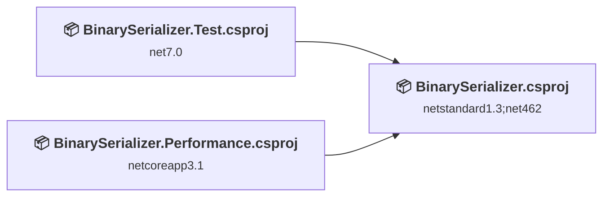
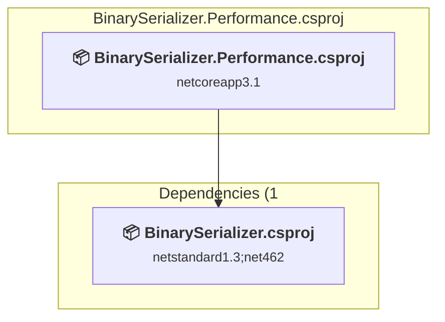
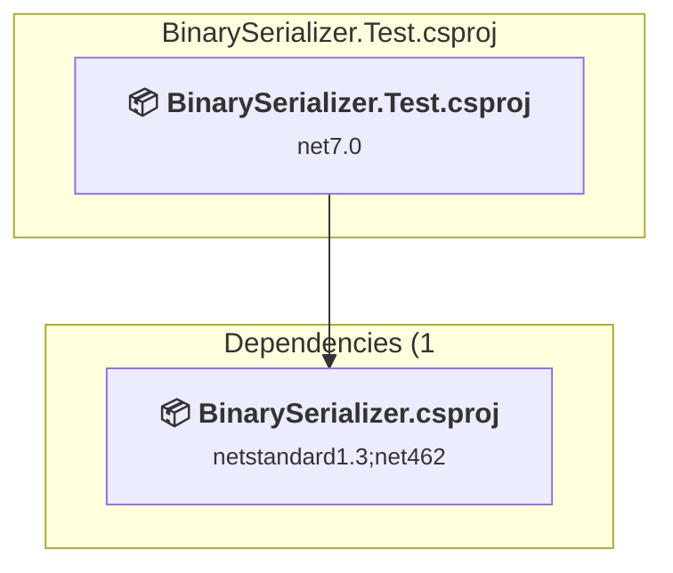
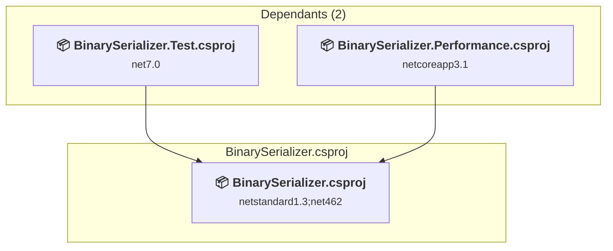

# Projects and dependencies analysis

This document provides a comprehensive overview of the projects and their dependencies in the context of upgrading to .NETCoreApp,Version=v10.0.

## Table of Contents

- [Executive Summary](#executive-Summary)
  - [Highlevel Metrics](#highlevel-metrics)
  - [Projects Compatibility](#projects-compatibility)
  - [Package Compatibility](#package-compatibility)
  - [API Compatibility](#api-compatibility)
- [Aggregate NuGet packages details](#aggregate-nuget-packages-details)
- [Top API Migration Challenges](#top-api-migration-challenges)
  - [Technologies and Features](#technologies-and-features)
  - [Most Frequent API Issues](#most-frequent-api-issues)
- [Projects Relationship Graph](#projects-relationship-graph)
- [Project Details](#project-details)

  - [BinarySerializer.Performance\BinarySerializer.Performance.csproj](#binaryserializerperformancebinaryserializerperformancecsproj)
  - [BinarySerializer.Test\BinarySerializer.Test.csproj](#binaryserializertestbinaryserializertestcsproj)
  - [BinarySerializer\BinarySerializer.csproj](#binaryserializerbinaryserializercsproj)

## Executive Summary

### Highlevel Metrics

| Metric | Count | Status |
| :--- | :---: | :--- |
| Total Projects | 3 | All require upgrade |
| Total NuGet Packages | 21 | 1 need upgrade |
| Total Code Files | 600 |  |
| Total Code Files with Incidents | 4 |  |
| Total Lines of Code | 22598 |  |
| Total Number of Issues | 19 |  |
| Estimated LOC to modify | 2+ | at least 0.0% of codebase |

### Projects Compatibility

| Project | Target Framework | Difficulty | Package Issues | API Issues | Est. LOC Impact | Description |
| :--- | :---: | :---: | :---: | :---: | :---: | :--- |
| [BinarySerializer.Performance\BinarySerializer.Performance.csproj](#binaryserializerperformancebinaryserializerperformancecsproj) | netcoreapp3.1 | 🟢 Low | 1 | 0 |  | DotNetCoreApp, Sdk Style = True |
| [BinarySerializer.Test\BinarySerializer.Test.csproj](#binaryserializertestbinaryserializertestcsproj) | net7.0 | 🟢 Low | 1 | 0 |  | DotNetCoreApp, Sdk Style = True |
| [BinarySerializer\BinarySerializer.csproj](#binaryserializerbinaryserializercsproj) | netstandard1.3;net462 | 🟢 Low | 12 | 2 | 2+ | ClassLibrary, Sdk Style = True |

### Package Compatibility

| Status | Count | Percentage |
| :--- | :---: | :---: |
| ✅ Compatible | 20 | 95.2% |
| ⚠️ Incompatible | 0 | 0.0% |
| 🔄 Upgrade Recommended | 1 | 4.8% |
| ***Total NuGet Packages*** | ***21*** | ***100%*** |

### API Compatibility

| Category | Count | Impact |
| :--- | :---: | :--- |
| 🔴 Binary Incompatible | 0 | High - Require code changes |
| 🟡 Source Incompatible | 0 | Medium - Needs re-compilation and potential conflicting API error fixing |
| 🔵 Behavioral change | 2 | Low - Behavioral changes that may require testing at runtime |
| ✅ Compatible | 15514 |  |
| ***Total APIs Analyzed*** | ***15516*** |  |

## Aggregate NuGet packages details

| Package | Current Version | Suggested Version | Projects | Description |
| :--- | :---: | :---: | :--- | :--- |
| coverlet.collector | 6.0.0 |  | [BinarySerializer.Test.csproj](#binaryserializertestbinaryserializertestcsproj) | ✅Compatible |
| coverlet.msbuild | 6.0.0 |  | [BinarySerializer.Test.csproj](#binaryserializertestbinaryserializertestcsproj) | ✅Compatible |
| Microsoft.NET.Test.Sdk | 17.6.2 |  | [BinarySerializer.Test.csproj](#binaryserializertestbinaryserializertestcsproj) | ✅Compatible |
| Microsoft.SourceLink.GitHub | 1.1.1 |  | [BinarySerializer.csproj](#binaryserializerbinaryserializercsproj) [BinarySerializer.Performance.csproj](#binaryserializerperformancebinaryserializerperformancecsproj) | ✅Compatible |
| MSTest.TestAdapter | 3.0.4 |  | [BinarySerializer.Test.csproj](#binaryserializertestbinaryserializertestcsproj) | ✅Compatible |
| MSTest.TestFramework | 3.0.4 |  | [BinarySerializer.Test.csproj](#binaryserializertestbinaryserializertestcsproj) | ✅Compatible |
| NETStandard.Library | 1.6.1 |  | [BinarySerializer.csproj](#binaryserializerbinaryserializercsproj) | ✅Compatible |
| System.Collections | 4.3.0 |  | [BinarySerializer.csproj](#binaryserializerbinaryserializercsproj) | NuGet package functionality is included with framework reference |
| System.IO | 4.3.0 |  | [BinarySerializer.csproj](#binaryserializerbinaryserializercsproj) | NuGet package functionality is included with framework reference |
| System.Linq | 4.3.0 |  | [BinarySerializer.csproj](#binaryserializerbinaryserializercsproj) | NuGet package functionality is included with framework reference |
| System.Linq.Expressions | 4.3.0 |  | [BinarySerializer.csproj](#binaryserializerbinaryserializercsproj) | NuGet package functionality is included with framework reference |
| System.Reflection | 4.3.0 |  | [BinarySerializer.csproj](#binaryserializerbinaryserializercsproj) | NuGet package functionality is included with framework reference |
| System.Reflection.Extensions | 4.3.0 |  | [BinarySerializer.csproj](#binaryserializerbinaryserializercsproj) | NuGet package functionality is included with framework reference |
| System.Reflection.TypeExtensions | 4.7.0 |  | [BinarySerializer.csproj](#binaryserializerbinaryserializercsproj) | NuGet package functionality is included with framework reference |
| System.Resources.ResourceManager | 4.3.0 |  | [BinarySerializer.csproj](#binaryserializerbinaryserializercsproj) | NuGet package functionality is included with framework reference |
| System.Runtime | 4.3.1 |  | [BinarySerializer.csproj](#binaryserializerbinaryserializercsproj) | NuGet package functionality is included with framework reference |
| System.Runtime.Extensions | 4.3.1 |  | [BinarySerializer.csproj](#binaryserializerbinaryserializercsproj) | NuGet package functionality is included with framework reference |
| System.Runtime.Serialization.Formatters | 4.3.0 |  | [BinarySerializer.Performance.csproj](#binaryserializerperformancebinaryserializerperformancecsproj) | NuGet package functionality is included with framework reference |
| System.Text.Encoding | 4.3.0 |  | [BinarySerializer.csproj](#binaryserializerbinaryserializercsproj) | NuGet package functionality is included with framework reference |
| System.Text.Encoding.CodePages | 6.0.0 | 10.0.5 | [BinarySerializer.Test.csproj](#binaryserializertestbinaryserializertestcsproj) | NuGet package upgrade is recommended |
| System.Threading | 4.3.0 |  | [BinarySerializer.csproj](#binaryserializerbinaryserializercsproj) | NuGet package functionality is included with framework reference |

## Top API Migration Challenges

### Technologies and Features

| Technology | Issues | Percentage | Migration Path |
| :--- | :---: | :---: | :--- |

### Most Frequent API Issues

| API | Count | Percentage | Category |
| :--- | :---: | :---: | :--- |
| M:System.IO.BinaryReader.ReadString | 2 | 100.0% | Behavioral Change |

## Projects Relationship Graph

Legend:
📦 SDK-style project
⚙️ Classic project

## Project Details

### BinarySerializer.Performance\BinarySerializer.Performance.csproj

#### Project Info

- **Current Target Framework:** netcoreapp3.1
- **Proposed Target Framework:** net10.0
- **SDK-style**: True
- **Project Kind:** DotNetCoreApp
- **Dependencies**: 1
- **Dependants**: 0
- **Number of Files**: 5
- **Number of Files with Incidents**: 1
- **Lines of Code**: 287
- **Estimated LOC to modify**: 0+ (at least 0.0% of the project)

#### Dependency Graph

Legend:
📦 SDK-style project
⚙️ Classic project

### API Compatibility

| Category | Count | Impact |
| :--- | :---: | :--- |
| 🔴 Binary Incompatible | 0 | High - Require code changes |
| 🟡 Source Incompatible | 0 | Medium - Needs re-compilation and potential conflicting API error fixing |
| 🔵 Behavioral change | 0 | Low - Behavioral changes that may require testing at runtime |
| ✅ Compatible | 206 |  |
| ***Total APIs Analyzed*** | ***206*** |  |

### BinarySerializer.Test\BinarySerializer.Test.csproj

#### Project Info

- **Current Target Framework:** net7.0
- **Proposed Target Framework:** net10.0
- **SDK-style**: True
- **Project Kind:** DotNetCoreApp
- **Dependencies**: 1
- **Dependants**: 0
- **Number of Files**: 484
- **Number of Files with Incidents**: 1
- **Lines of Code**: 11282
- **Estimated LOC to modify**: 0+ (at least 0.0% of the project)

#### Dependency Graph

Legend:
📦 SDK-style project
⚙️ Classic project

### API Compatibility

| Category | Count | Impact |
| :--- | :---: | :--- |
| 🔴 Binary Incompatible | 0 | High - Require code changes |
| 🟡 Source Incompatible | 0 | Medium - Needs re-compilation and potential conflicting API error fixing |
| 🔵 Behavioral change | 0 | Low - Behavioral changes that may require testing at runtime |
| ✅ Compatible | 8356 |  |
| ***Total APIs Analyzed*** | ***8356*** |  |

### BinarySerializer\BinarySerializer.csproj

#### Project Info

- **Current Target Framework:** netstandard1.3;net462
- **Proposed Target Framework:** netstandard1.3;net462;net10.0
- **SDK-style**: True
- **Project Kind:** ClassLibrary
- **Dependencies**: 0
- **Dependants**: 2
- **Number of Files**: 114
- **Number of Files with Incidents**: 2
- **Lines of Code**: 11029
- **Estimated LOC to modify**: 2+ (at least 0.0% of the project)

#### Dependency Graph

Legend:
📦 SDK-style project
⚙️ Classic project

### API Compatibility

| Category | Count | Impact |
| :--- | :---: | :--- |
| 🔴 Binary Incompatible | 0 | High - Require code changes |
| 🟡 Source Incompatible | 0 | Medium - Needs re-compilation and potential conflicting API error fixing |
| 🔵 Behavioral change | 2 | Low - Behavioral changes that may require testing at runtime |
| ✅ Compatible | 6952 |  |
| ***Total APIs Analyzed*** | ***6954*** |  |

